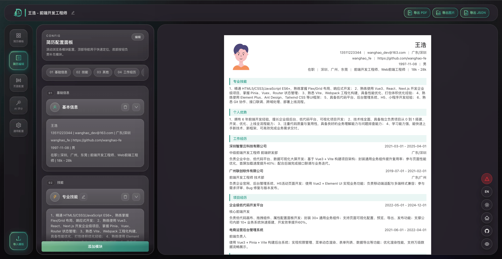

<h1 align="center">EasyResume</h1>

<p align="center">
  <a href="./README.md">简体中文</a>
  &nbsp;|&nbsp;
  <strong>English</strong>
</p>

<p align="center">AI resume editor · Fast editing · Data security · Local storage backup · AI-assisted</p>
<p align="center">Online resume editor built on Next.js 14 (App Router): visually compose modules, rich text editing, drag-and-drop layout, with PDF / PNG export via Puppeteer.</p>

<p align="center">
  <a href="https://resume.qdabuliuq.cn/"><strong>🌐 Live demo</strong></a>
</p>

<p align="center">
  
  
  <br>
  
  
  
  
  <br>
  
  
</p>

<p align="center">
  
</p>

## ✨ Features

- Modular resume editing (profile, work experience, projects, education, skills, certifications, etc.)
- Canvas preview with grid layout (`react-grid-layout`)
- Quill rich text with sanitized HTML (DOMPurify)
- Server-rendered resume HTML; PDF/PNG export APIs
- AI-assisted polishing and optimization

## 🛠️ Stack

| Area | Choice |
|------|--------|
| Framework | Next.js 14, React 19, TypeScript |
| UI | Ant Design 5, Tailwind CSS 4 |
| State | MobX, mobx-react |
| Editor / layout | Quill, @dnd-kit, react-grid-layout |
| Export | Puppeteer |
| Tooling | ESLint 9, Prettier, Husky, Commitlint |

## 💻 Requirements

- **Node.js** ≥ 18.17 (see `package.json` `engines`)
- **PDF/PNG**: Chromium must be available in production; default executable `/usr/bin/chromium-browser`, or set via environment variables (see table below)

## 🚀 Quick start

```bash
npm install
# If React / Next peer dependency conflicts:
# npm install --legacy-peer-deps

npm run dev
```

The dev server port is assigned by Next.js. Local URLs look like `http://localhost:3000/zh/edit` (use the port printed in the terminal).

Production build and run:

```bash
npm run build
npm run start
```

The `start` script listens on **3010**.

## 📜 Scripts

| Command | Description |
|---------|-------------|
| `npm run dev` | Development |
| `npm run build` | Production build |
| `npm run start` | Production server (port 3010) |
| `npm run lint` | ESLint |
| `npm run lint:pritter` | Prettier format `src/` |
| `npm run prepare` | Husky (runs after `npm install`) |
| `npm run commit` | Gitmoji interactive commit (install `gitmoji-cli` globally or locally) |

## 🔐 Environment variables

Create `.env.local` at the project root (do not commit secrets). See `.env.local.example` for reference.

### Local development

| Variable | Required | Description |
|----------|----------|-------------|
| `BIGMODEL_API_KEY` | Yes | API key from [Zhipu AI Open Platform](https://open.bigmodel.cn/) for AI polish, resume scoring, etc. (default model: GLM-4.7-Flash) |
| `CHATANYWHERE_API_KEY` | Yes | Key from [ChatAnywhere free API](https://github.com/chatanywhere/GPT_API_free); used as fallback when Zhipu requests fail (default model: deepseek-v4-flash) |
| `PUPPETEER_EXECUTABLE_PATH` | No | Browser executable for PDF/PNG export via Puppeteer. In dev, Puppeteer’s bundled Chromium is used if unset; in production on Linux the default is `/usr/bin/chromium-browser` |

`PUPPETEER_EXECUTABLE_PATH` examples:

| OS | Example path |
|----|--------------|
| macOS (Google Chrome) | `/Applications/Google Chrome.app/Contents/MacOS/Google Chrome` |
| Windows (Google Chrome) | `C:\Program Files\Google\Chrome\Application\chrome.exe` |
| Linux (Chromium) | `/usr/bin/chromium-browser` or `/usr/bin/chromium` |

### Deployment only

Configure these on the server:

| Variable | Description |
|----------|-------------|
| `RESUME_PROJECT_ROOT` | Absolute project path on the server, e.g. `/root/easy-resume` (PM2 / script working directory) |
| `NEXT_PUBLIC_SITE_URL` | Public site root URL, e.g. `https://resume.example.com`; used for PDF link resolution and site metadata. **Must be set before `npm run build`** or it won’t be embedded in the client bundle |

Optional (for AI score rate limiting and caching; see `.env.local.example`):

| Variable | Description |
|----------|-------------|
| `UPSTASH_REDIS_REST_URL` | [Upstash Redis](https://console.upstash.com) REST URL |
| `UPSTASH_REDIS_REST_TOKEN` | Upstash Redis REST Token |

## 📂 Project layout (summary)

```
src/
  app/           # App Router: pages, layout, API routes (pdf/png/version/chat, etc.)
  components/    # Shared components
  views/edit/    # Editor shell (canvas, sidebar, header, etc.)
  modules/       # Resume module renderers & types
  mobx/          # Global state
  lib/           # Puppeteer, fonts, API proxies, helpers
  utils/         # Utilities
  json/          # Default resume & template data
public/          # Static assets (fonts, etc.)
middleware.ts    # Next.js middleware
```

## 🐳 Docker deployment

```bash
docker-compose up -d
```

Open: `http://localhost:3010/zh`
