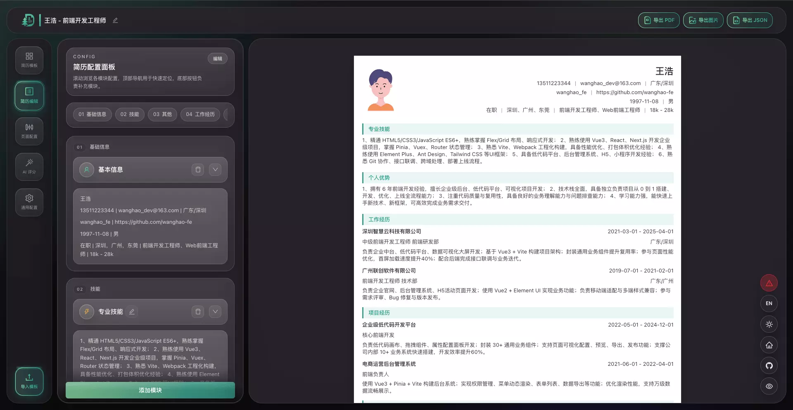

<h1 align="center">青松简历</h1>

  <a href="./README.md"><strong>简体中文（默认）</strong></a>
  &nbsp;|&nbsp;
  <a href="./README.en.md">English</a>

  

完整说明见 <a href="./README.md">README.md</a>（与本文档内容一致）。

